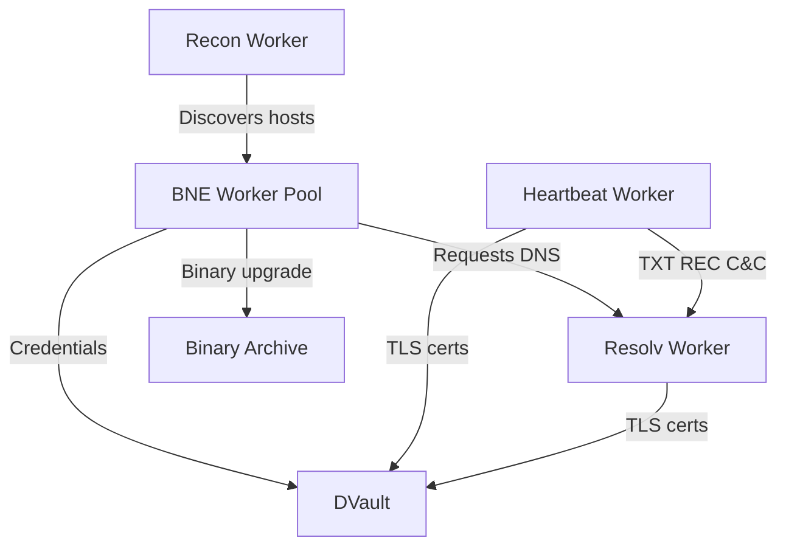

This page provides detailed technical specifications for each of Proone's four worker subsystems.

## Heartbeat Worker

The Heartbeat subsystem implements a backdoor and command & control mechanism on infected devices.

### Protocol Design

The **Heartbeat protocol** is a point-to-point or broadcast framing protocol that operates over transport streams like TCP/IP.

**Security Features:**
- TLS encryption for all communications
- Two-way certificate verification
- Application-Layer Protocol Negotiation (ALPN) checking
- Hardcoded TLS certificates and private keys

### C&C Mechanisms

<CardGroup cols={2}>
  <Card title="TXT Record C&C" icon="text">
    Uses DNS TXT records for command distribution via the Resolv worker
  </Card>
  <Card title="Local Backdoor" icon="network-wired">
    Listens on a local port for direct M2M connections from other Proone instances
  </Card>
</CardGroup>

### Extensibility

<Note>
Proone does not provide built-in "attack features" like DDoS. The Heartbeat subsystem enables users to add functionality by:
- Patching Proone and upgrading binaries of instances
- Creating separate programs and deploying them via Heartbeat
</Note>

### Reference Documentation

The Heartbeat protocol is documented separately in `htbt.md` with complete protocol specifications.

---

## Recon Worker

The Reconnaissance worker discovers vulnerable nodes on both internet and link-local networks.

### Configuration

The Recon worker accepts two primary parameters:

1. **Target network list** - Networks to scan for vulnerable hosts
2. **Blacklist network list** - Networks to exclude from scanning

**Configuration Sources:**
- Standalone tool: `/src/data/recon.sample.conf`
- Hardcoded values: `PRNE_RCN_T_IPV4`, `PRNE_RCN_BL_IPV4`, `PRNE_RCN_T_IPV6`, `PRNE_RCN_BL_IPV6` macros
- Target ports: `PRNE_RCN_PORTS` macro

### Network Targeting Strategy

<Steps>
  <Step title="Specify target networks">
    At least one target network per IP version must be specified. You can target all networks with `0.0.0.0/0` (IPv4) and `::/0` (IPv6)
  </Step>
  
  <Step title="Configure blacklists">
    Add special-use networks to blacklist:
    - IPv4: `127.0.0.0/8`, `224.0.0.0/4`
    - IPv6: `::/128`, `::1/128`, `1::/64`
  </Step>
  
  <Step title="Consider private networks">
    Decide whether to blacklist private network addresses (devices behind NAT)
  </Step>
</Steps>

<Warning>
While NATed devices can still be controlled via TXT REC C&C, infecting too many devices on a private network can strain the NAT router, which is typically a low to mid-range device.
</Warning>

### IPv4 Discovery Mechanism

**Packet Crafting:**
- Sends fabricated TCP SYN packets to random IPs within target networks
- Each packet contains a special signature generated per iteration cycle
- Target ports defined by `PRNE_RCN_PORTS` macro

**Response Handling:**
- Uses raw sockets to receive all IP packets the host receives
- Recognizes SYN+ACK responses by matching signatures
- Invokes callback to notify Proone main of discovered host
- Cycle duration: 1 second ± jitter (effective timeout value)

**Kernel Interaction:**
```text
Crafted SYN → Target Host → SYN+ACK → Recon Worker (recognized)
                                   ↓
                              Kernel sends RST (unrecognized connection)
```

<Note>
Crafted TCP packets sent via raw sockets are not managed by the kernel. For each SYN+ACK received, the kernel automatically sends an RST packet since it doesn't recognize the connection.
</Note>

### IPv6 Discovery Mechanism

IPv6's massive address space requires a different approach than random scanning.

**Link-Local Discovery Process:**

<Steps>
  <Step title="Query interface addresses">
    Use platform-specific APIs to obtain link-local addresses and scope IDs assigned to network interfaces
  </Step>
  
  <Step title="Multicast probe packets">
    Send ICMPv6 ECHO packets with bogus DSTOPT (0x9e - reserved for private experimentation) to link-local multicast addresses
  </Step>
  
  <Step title="Process error responses">
    IPv6 spec requires nodes to send ICMPv6 type 4, code 2 (unrecognized DSTOPT) without processing the ECHO request
  </Step>
  
  <Step title="Handle non-compliant implementations">
    Also process standard ECHO replies in case implementations ignore the spec and process the ICMPv6 data
  </Step>
  
  <Step title="Confirm open ports">
    Upon receiving ICMPv6 4/2 or ECHO reply, send TCP SYN to verify target ports are open
  </Step>
</Steps>

**Technical References:**
- [RFC7707](https://datatracker.ietf.org/doc/html/rfc7707) - Network Reconnaissance in IPv6 Networks
- [RFC4727](https://datatracker.ietf.org/doc/html/rfc4727) - Experimental Values In IPv4, IPv6, ICMPv4, ICMPv6, UDP, and TCP Headers
- [IANA IPv6 Parameters](https://www.iana.org/assignments/ipv6-parameters/ipv6-parameters.xhtml)

### Socket Architecture

Recon creates 4 raw sockets total on IPv6-capable hosts:

| Purpose | IPv4 | IPv6 |
|---------|------|------|
| Sending packets | 1 socket | 1 socket |
| Receiving packets | 1 socket | 1 socket |

<Note>
Mirai uses only one socket for both sending and receiving. Proone uses 4 due to:
- Inconsistency with `IP_HDRINCL` flag (Linux kernel doesn't support it for IPv6)
- Different approach needed for IPv6 discovery
- Need for 2 socket types per IP version
</Note>

---

## BNE Worker Pool

The Break and Enter worker exploits vulnerabilities to gain access to target hosts.

### Attack Vectors

<CardGroup cols={2}>
  <Card title="Credential Brute Force" icon="key">
    Dictionary-based attacks using combo lists of common credentials
  </Card>
  <Card title="M2M Backdoor" icon="handshake">
    Attempts Local Backdoor connection first when Heartbeat vector is enabled
  </Card>
  <Card title="SSH Exploitation" icon="terminal">
    SSH-based attacks using libssh2
  </Card>
  <Card title="Extensible Interface" icon="puzzle-piece">
    Can be extended for zero-day RCE vulnerabilities
  </Card>
</CardGroup>

### M2M Binary Upgrade Process

When the Heartbeat vector is enabled:

<Steps>
  <Step title="Initial connection attempt">
    BNE tries Local Backdoor port on target before using abusive methods
  </Step>
  
  <Step title="TLS verification">
    Successful TLS connection with 2-way certificate verification and ALPN check confirms target is running Proone
  </Step>
  
  <Step title="Version comparison">
    Worker determines which host has newer version
  </Step>
  
  <Step title="Binary recombination">
    If remote host runs old version, update its executable. If local is old, update from remote. Achieved via binary recombination process.
  </Step>
</Steps>

<Note>
Binary upgrade functionality can be disabled by making the callback function always return 0.
</Note>

### Worker Lifecycle

Unlike service-based workers (Heartbeat, Recon, Resolv), BNE workers are **task-based**:

- Spawned on-demand when Recon discovers a target
- Exits after task completion (successful compromise or all vectors exhausted)
- Multiple instances run simultaneously using cooperative multitasking

### Resource Management

**Worker Pool Limits:**
- Maximum: 128 concurrent workers (`PROONE_BNE_MAX_CNT`)
- Priority: Lowest (prevents starvation of vital workers)
- Failure mode: `ENOMEM` when memory exhausted

<Warning>
On embedded devices, the process will typically run out of memory before reaching 128 workers. The arbitrary limit exists as a safeguard, but resource exhaustion or thread starvation usually occurs first.
</Warning>

**Priority Rationale:**
BNE workers have the lowest priority to minimize starvation of critical subsystems like Heartbeat and Recon during high activity periods.

---

## Resolv Worker

A custom DNS resolver specifically designed for Proone's command and control needs.

### Query Model

Implements a **promise-future pattern** for asynchronous DNS resolution:

```c
// Conceptual flow
Future* future = resolv_query("example.com", TXT);
pth_wait(future);  // Block using Pth cooperative scheduling
Result* result = future_get_result(future);
```

**Benefits:**
- Non-blocking query submission
- Efficient cooperative multitasking with Pth
- Caller controls when to block waiting for results

### Connection Pooling

The Resolv worker maintains persistent connections to DNS over TLS servers:

<Steps>
  <Step title="Initial connection">
    Establishes TLS connection to hardcoded public DoT nameserver
  </Step>
  
  <Step title="Keep-alive">
    Connection remains open for a configured duration after query completion
  </Step>
  
  <Step title="Reuse">
    Subsequent queries use existing connection if still alive
  </Step>
  
  <Step title="Graceful close">
    Sends SSL "close notify" alert when closing connection gracefully
  </Step>
</Steps>

<Note>
Some DoT servers don't appreciate the "close notify" alert and drop connections with RST immediately. This has no functional side effects.
</Note>

### Failover Strategy

When errors or connection drops occur:

1. **Random selection** - Another hardcoded nameserver randomly selected from pool
2. **Query continuation** - Query continues with new server
3. **Multi-server queries** - Single query may involve multiple servers (relevant during DNS propagation)
4. **Connection timeout** - Short timeout prevents hanging on offline servers
5. **Network detection** - Circles through nameservers until query times out if no internet

### Record Type Support

The Resolv worker supports only essential record types:

| Record Type | Purpose |
|-------------|----------|
| TXT | Primary C&C command distribution |
| A | IPv4 address resolution |
| AAAA | IPv6 address resolution |

### Security Features

<CardGroup cols={2}>
  <Card title="DNS over TLS" icon="lock">
    All queries encrypted using DoT to hardcoded public nameservers
  </Card>
  <Card title="Hardcoded TLS Keys" icon="certificate">
    Uses hardcoded certificates and private keys to obfuscate traffic analysis
  </Card>
  <Card title="No System Config" icon="ban">
    Completely independent of system DNS configuration
  </Card>
  <Card title="Public Nameservers" icon="globe">
    Only uses hardcoded public DoT servers
  </Card>
</CardGroup>

<Warning>
The Resolv worker does **not** depend on system configuration files like `/etc/resolv.conf`. This makes traffic harder to analyze but also means it bypasses network DNS policies.
</Warning>

## Worker Dependencies

Understanding how subsystems interact:



## Performance Characteristics

| Subsystem | Type | Priority | Resource Usage |
|-----------|------|----------|----------------|
| Heartbeat | Service | Normal | Low (event-driven) |
| Recon | Service | Normal | Medium (raw sockets) |
| Resolv | Service | Normal | Low (connection pooled) |
| BNE | Task pool | Lowest | High (up to 128 workers) |

## Next Steps

<Card title="Design Decisions" icon="lightbulb" href="/architecture/design-decisions">
  Learn about the architectural choices and their rationale
</Card>